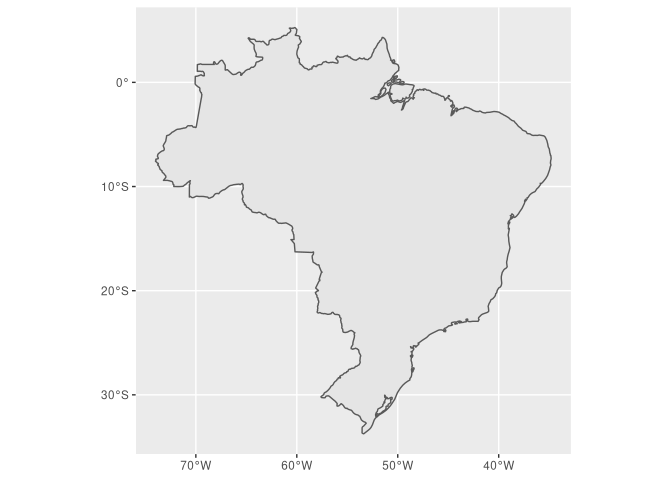
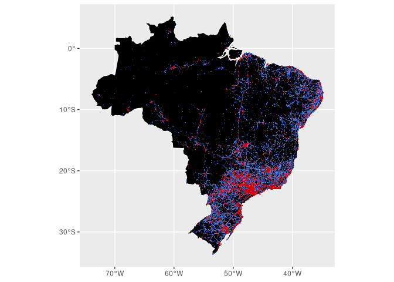

Cell Towers Brazil
================
Rafael Lopes (@rafalpx)

## Cell Towers

This is a repository to codes and plots of cell towers in Brazilian
territories. From the [opencellid.org](opencellid.org) you can download
the data for the exact location of each cell tower by type. In this
repository there is a copy of the data set the file ‘724.csv.gz’.
Filtering this ‘.csv’ on the extent of the desired administrative cut
you can plot easily the cell towers location on a map.

The Following sections gives examples on how to plot filter and plot on
any Brazilian extent using the `{r}` package `geobr`.

## Necessary Libraries

``` r
library(dplyr)
```

    ## 
    ## Attaching package: 'dplyr'

    ## The following objects are masked from 'package:stats':
    ## 
    ##     filter, lag

    ## The following objects are masked from 'package:base':
    ## 
    ##     intersect, setdiff, setequal, union

``` r
library(readr)
library(ggplot2)
library(ggtext)
library(sf)
```

    ## Linking to GEOS 3.9.1, GDAL 3.4.0, PROJ 8.2.0; sf_use_s2() is TRUE

``` r
library(rnaturalearth)
library(rnaturalearthdata)
library(geobr)

#Functions to take the IBGE codes of State Capitals
source("Functions/functions.R")
```

## Filtering on Cell Towers dataset

On the dataset filtering the extent of Brazil, before we set up the CRS
of the `celltowers` dataframe:

``` r
## Setting the CRS for the celltowers dataset
celltowers <- read_csv("Data/724.csv.gz")|> 
  sf::st_as_sf(coords = c("lon", "lat"), crs = 4326)
```

    ## Rows: 1833130 Columns: 14

    ## ── Column specification ────────────────────────────────────────────────────────
    ## Delimiter: ","
    ## chr  (1): radio
    ## dbl (13): mcc, net, area, cell, unit, lon, lat, range, samples, changeable, ...

    ## 
    ## ℹ Use `spec()` to retrieve the full column specification for this data.
    ## ℹ Specify the column types or set `show_col_types = FALSE` to quiet this message.

``` r
## Getting the extent of Brasil
brasil <- ne_countries(scale = 'medium', type = 'map_units', returnclass = 'sf') |>
  filter(name == 'Brazil')

## Filtering towers by type
### 3G
UMTS <- celltowers |> 
  filter(radio == "UMTS") |>
  st_intersection(brasil)
```

    ## Warning: attribute variables are assumed to be spatially constant throughout all
    ## geometries

``` r
### 4G
LTE <- celltowers |> 
  filter(radio == "LTE") |>
  st_intersection(brasil)
```

    ## Warning: attribute variables are assumed to be spatially constant throughout all
    ## geometries

## Plots

``` r
## A Quick plot of the extent
ggplot() + 
  geom_sf(data = brasil)
```

<!-- -->

``` r
## A plot of celltowers on the map
ggplot() + 
  geom_sf(data = brasil, fill = "black", color = "white", size = 0.3) + 
  geom_sf(data = UMTS, shape = ".", color = "#4d88ff", alpha = 0.3) +
  geom_sf(data = LTE, shape = ".", color = "#cc0000", alpha = 0.5)
```

<!-- -->

``` r
## Saving the plot
# ggsave("my_plot_br.png", height = 7, width = 7) 
```

## Plot with HTML

``` r
x <- ggplot() + 
  geom_sf(data = brasil, fill = "black", color = "white", size = 0.3) + 
  geom_sf(data = UMTS, shape = ".", color = "#4d88ff", alpha = 0.3) +
  geom_sf(data = LTE, shape = ".", color = "#cc0000", alpha = 0.5) +
  theme_void() +
  labs(
    title = "<span style='color: white; text-align: center;'>Cell tower distribution with <br> <span style='color: #cc0000'>4G</span> (LTE) and <span style='color: #4d88ff'>3G</span> (UMTS)</span>",
    caption = "<span style='color: white;'> Made by Rafael Lopes <b>&middot;</b> <br>Original plot by Dominic Royé and with codes by Etienne Bacher <b>&middot;</b> Data from opencellid.org </span></br>"
  ) +
  theme(
    plot.background = element_rect(fill = "black"),
    panel.background = element_rect(fill = "black"),
    plot.title = element_markdown(margin = margin(t = 40, b = -60, l = 10), size = 20),
    plot.caption = element_markdown(hjust = 0, margin = margin(l = 10, b = 20, t = -30)),
    text = element_text(family = "Roboto Condensed")
  )
x
```

<!-- -->

``` r
ggsave("my_plot_br.png", plot = x, height = 7, width = 7)
```
